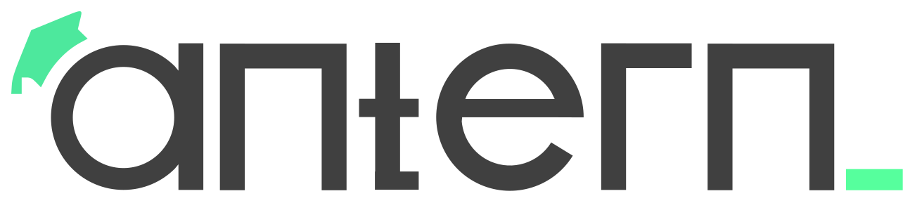

 

  

  <h3 align="center">One-stop solution for all your Data Science learning needs.</h3>

  

    All in one place, the best resources to learn Data Science with comprehensive and detailed roadmaps.
     
    <a href="https://antern.co/"><strong>Go to website</strong></a>
     
    

      Join our <a href="https://discord.gg/t9uKG2m9" target="_blank">
      
    <b>Antern Community</b> </a> and ask your questions there. 
    

  

# Data Science Roadmap 🤖

All in one place, the best resources to learn Data Science with comprehensive and detailed roadmaps. Data Science is a vast field and it is very difficult to find the best resources to learn it. This repository is an attempt to solve this problem. It contains the best resources to learn Data Science with comprehensive and detailed roadmaps.

It also contains the best resources to learn Machine Learning, Deep Learning, Data Analysis, Data Visualization, and much more. This repository is a one-stop solution for all your Data Science learning needs.

It is a continuously evolving repository and I will keep adding more resources to it. If you have any suggestions or want to contribute to this repository, feel free to open an issue or a pull request.

## Table of Contents

I will divide the resources into different levels of learning and will also provide the best resources to learn each topic. The levels of learning are:

- **Fundamentals before Data Science Stage 1**
- **Core Data Science Fundamentals**
- **Intermediate Data Science**
- **Advanced Data Science**
- **Data Science Projects**
- **Guide to Data Science Interviews**
- **Recommended Timeline to follow this roadmap**
- **Tips/Tricks for following the roadmap**

## Let's get ready to learn data science 🚀

| Topic                        | Resources & Links                                                                                                                                                                                                                                                           |
| ---------------------------- | --------------------------------------------------------------------------------------------------------------------------------------------------------------------------------------------------------------------------------------------------------------------------- |
| Linear Algebra               | [Introduction to Linear Algebra by Gilbert Strang, Book](https://math.mit.edu/~gs/linearalgebra/), [Linear Algebra by Antern, Course](https://www.youtube.com/playlist?list=PLITqwrDNk9XDed3jCyByVFBO-EeW6kTy8), [Linear Algebra for Dummies Book by Mary Jane Sterling](#) |
| Calculus                     | [Calculus for Dummies, Book](#) , [Single Variable Calculus Course by Antern](https://www.youtube.com/playlist?list=PLITqwrDNk9XBuvyyEbSM-au7BpVdGwabZ)                                                                                                                     |
| Statistics & Probability     | [Statistics for Dummies, Book](#), [Probability for Dummies, Book](#), [Statistics and Probability Course by Antern](#)                                                                                                                                                     |
| Basics of Information Theory | [Information Theory by d2l.ai](https://d2l.ai/chapter_appendix-mathematics-for-deep-learning/information-theory.html)                                                                                                                                                       |

### Evaluate your skills and prepare for Interviews 📝

| Topic                                        | Resources & Links                                                                                                                                                                                                                                                                                                                                                                                                                                                                      |
| -------------------------------------------- | -------------------------------------------------------------------------------------------------------------------------------------------------------------------------------------------------------------------------------------------------------------------------------------------------------------------------------------------------------------------------------------------------------------------------------------------------------------------------------------- |
| Linear Algebra Questions                     | [Linear Algebra Interview questions](https://www.mlstack.cafe/blog/linear-algebra-interview-questions)                                                                                                                                                                                                                                                                                                                                                                                 |
| Statistics & Probability Interview Questions | [Link 1](https://towardsdatascience.com/50-statistics-interview-questions-and-answers-for-data-scientists-for-2021-24f886221271), [Link 2](https://www.nicksingh.com/posts/40-probability-statistics-data-science-interview-questions-asked-by-fang-wall-street), [Link 3](https://github.com/kojino/120-Data-Science-Interview-Questions/blob/master/probability.md), [Link 4](https://towardsdatascience.com/14-probability-problems-for-acing-data-science-interviews-3735025a6425) |

**Learning Tip 1 💁**: If you're are a beginnner and not able to answer interview questions, it's totally ok, you can look upto the solutions and solve similar types of problems on your own to practice those types of questions. You don't need to learn every concept, if you're not able to understand it, just skip it and move on to the next topic and review next day or try to get help from communities such as discord communities.

**Interview Tip 1 💁**: While answering questions, try to explain in such a way that you're building your solution from base, if you know the answer, start with explaining how you reached to that answer, don't tell your answer, explain your thought process. Interviews wants to check your problem solving skills. Even if you give wrong answer but your thought process is correct, interviewer might be impressed.

### Programming Languages & Data Structures and Algorithms 🖥️

| Lecture Topics                      | Resources & Links                                                                                                                                                                                          |
| ----------------------------------- | ---------------------------------------------------------------------------------------------------------------------------------------------------------------------------------------------------------- |
| Core Python                         | [Durga Sir Python](https://www.youtube.com/playlist?list=PLd3UqWTnYXOmzcSdWIh-EggqAtCXvJxzu), or [Corey Schafer](https://www.youtube.com/watch?v=YYXdXT2l-Gg&list=PL-osiE80TeTt2d9bfVyTiXJA-UTHn6WwU)      |
| Intermediate Python                 | [Corey Schafer](https://www.youtube.com/watch?v=ZDa-Z5JzLYM&list=PL-osiE80TeTsqhIuOqKhwlXsIBIdSeYtc)                                                                                                       |
| Advance Python                      | [Durga Sir Advance Python](https://www.youtube.com/watch?v=es457q7n3P8&list=PLd3UqWTnYXOkzPunQOObl4m_7i6aOIoQD)                                                                                            |
| Core Software Engineering Principle | [Robust Python](https://www.amazon.in/Robust-Python-Write-Clean-Maintainable/dp/1098100662) & [Design Patterns](https://google.github.io/styleguide/pyguide.html)                                          |
| Data Structures and Algorithms      | [Data Structures and Algorithms in Python](http://xpzhang.me/teach/DS19_Fall/book.pdf), [Introduction to Algorithms, MIT 6.006](https://ocw.mit.edu/courses/6-006-introduction-to-algorithms-spring-2020/) |

**Learning Tip 2 💁**: If you're a beginner and learning python, it will require time to reiterate several times to understand a concept, & trust me it's totally worth it. As said learning Data science requires time and learning the hard way rather than shortcuts which will make you nowhere. So, don't get demotivated if you're not able to understand a concept, just keep trying and you'll get it.

**Learning Tip 3 💁**: Data structures and algorithms is becoming one of the important topics in data science interview as well in giant companies, so it's important to learn it. Not only from the perspective of interviews, learning it and solving problems using dsa makes your problem solving skill and criticial thinking much more better than before and you will be having several tools in your toolbox to solve any problem. So I suggest to learn a particular topic and solve several questions on it, we will soon be adding several problems on this page to practice for data science.

### Frameworks 📚

| Topics     | Resources & Links                                                                                                                                                                                                                                                                                                                                                                                                                                          |
| ---------- | ---------------------------------------------------------------------------------------------------------------------------------------------------------------------------------------------------------------------------------------------------------------------------------------------------------------------------------------------------------------------------------------------------------------------------------------------------------- |
| Pandas     | [Pandas user Guide](https://pandas.pydata.org/docs/user_guide/index.html#user-guide), [Getting started with Pandas](https://pandas.pydata.org/docs/getting_started/intro_tutorials/index.html),[Python for Data Analysis: Data Wrangling with pandas, NumPy, and Jupyte, Book](https://www.pdfdrive.com/python-for-data-analysis-data-wrangling-with-pandas-numpy-and-ipython-e158189564.html), [Data School](https://www.youtube.com/c/dataschool/videos) |
| Numpy      | [Numpy Learn docs](https://numpy.org/learn/)                                                                                                                                                                                                                                                                                                                                                                                                               |
| Matplotlib | [Matplotlib Tutorial](https://matplotlib.org/stable/tutorials/index.html), [Corey Schafer Matplotlib Tutorials](https://www.youtube.com/playlist?list=PL-osiE80TeTvipOqomVEeZ1HRrcEvtZB_)                                                                                                                                                                                                                                                                  |

### Data Visualization & Analysis

| Topics             | Resources & Links                                                                                                                                                                                                                                                               |
| ------------------ | ------------------------------------------------------------------------------------------------------------------------------------------------------------------------------------------------------------------------------------------------------------------------------- |
| Data Analysis      | [Python for Data Analysis](https://www.amazon.com/Python-Data-Analysis-Wrangling-IPython/dp/1491957662), [Head First Data Analysis: A Learner's Guide to Big Numbers, Statistics, and Good Decisions](https://learning.oreilly.com/library/view/head-first-data/9780596806224/) |
| Data Visualization | [Fundamentals of Data Visualization: A Primer on Making Informative and Compelling Figures](https://clauswilke.com/dataviz/)                                                                                                                                                    |

**Learning Tip 4 💁**: Learning frameworks is not a big deal, but the way you use frameworks to analyze data, visualize data and solve problems is what matters. So, I suggest to understand the CRUX of data analysis and data visualization and use the frameworks to build your solution. If you don't know the actual CRUX of data visualization, analysis, then there is no point in learning frameworks. and If you don't know how to work with data, then there is no point in learning ML.

### SQL 📊

| Topics         | Resources & Links                                                                                                                                                                                           |
| -------------- | ----------------------------------------------------------------------------------------------------------------------------------------------------------------------------------------------------------- |
| SQL            | [SQL for Data Analysis Cathy Tanimura](https://learning.oreilly.com/library/view/sql-for-data/9781492088776/) or [Learning SQL ](https://learning.oreilly.com/library/view/learning-sql-3rd/9781492057604/) |
| Practicing SQL | [SQL Cookbook by By Anthony Molinaro](https://learning.oreilly.com/library/view/sql-cookbook/0596009763/), [DataLemur](https://datalemur.com/)                                                              |

Note: People usually have question around learning Big data tools in initial phases of data science, I personally think, it's not necessary to learn big data tools in initial phases of data science, but if you're interested in learning it, you can learn it later on. There are different perspectives on this, i would like you to check out the answers from this [quora answer](https://www.quora.com/Should-a-data-scientist-know-big-data-hadoop).

## Core Data Science Fundamentals 🚀

According to [Harvard business School](https://online.hbs.edu/blog/post/data-science-skills), Data science is the process of deriving meaningful insights from raw data. Data science aims to make sense of the copious amounts of data, also referred to as big data, that today’s organizations maintain.
